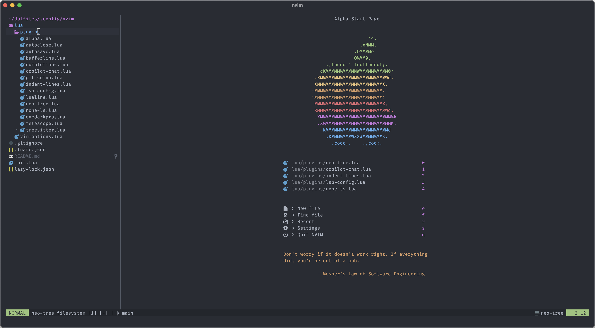

# `nvim` Configuration

| Start Screen | Code |
|--------------|------|
|  |  |

When I migrated to `nvim`, I had 3 goals in mind: Speed, simplicity, and elegance.

As such, I decided that it wasn't worth it to start from a prebuilt configuration, but rather piece together plugins and config by hand, to make sure that everything was necessary.

